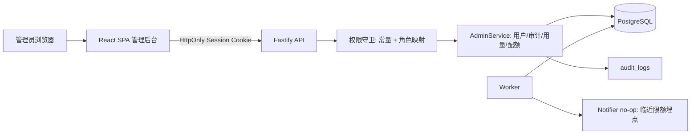
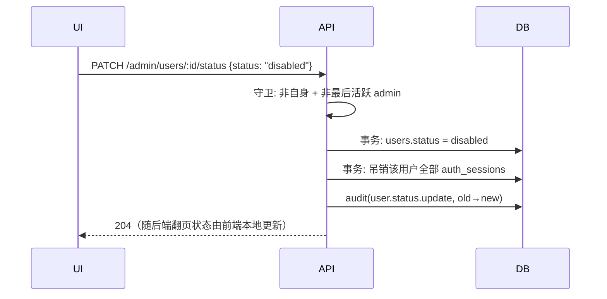

# MAWork 管理后台增强技术设计

## 1. 设计概述

本设计在一期模块化单体（React SPA + Fastify API + worker + PostgreSQL）之上扩展管理后台，不新增运行单元、不新增数据表、不引入新的外部依赖。四条指导原则：

1. **元数据可见、内容不可见**：所有新增管理视图只读元数据与聚合统计；transcript、事件载荷、附件与产物内容继续只归 Session 所有者。
2. **权限化守卫**：管理路由鉴权从 `requireAdmin` 布尔判断重构为权限常量 + 集中映射表，本期全部权限仍映射到 `admin` 角色，对外行为不变。
3. **只做增量 schema**：新增列与索引均为可空 / 带默认值的加法迁移；既有约束（`usage_ledger` 幂等唯一键、Session 双外键检查约束）不变。
4. **预留缝收敛到接口与调用点**：邀请制、通知渠道、组织多租户、SSO 的扩展点收敛为单一服务入口、`Notifier` 接口与权限映射表三处，不预建任何数据结构。

## 2. 既定决策与范围

| 决策 | 结论 | 预留方式 |
| --- | --- | --- |
| 邀请制 / 邮箱手机号建号 | 暂不做，管理员后台建号 | 单一建号服务入口 + `packages/auth` 适配层（见 §13） |
| 通知渠道 | 暂不做 | `Notifier` 接口 + no-op 实现 + 两处检测点埋点（见 §8.4） |
| 组织多租户 / SSO | 暂不做 | 权限集中映射表为唯一改动点；本期不引入 org 字段（见 §13） |
| 单用户删除、批量导入、数据保留 | 暂不做 | 无需结构预留；删除未来复用 `background_jobs` saga 框架 |
| 用量 rollup、趋势图、成本计价 | 暂不做 | `usage_ledger` 不可变，rollup 可随时重算回填；本期先入账归因列（§5.1） |

交付批次：R1 权限与账户生命周期 → R2 审计查询 → R3 用量与配额 → R4 账户详情页。R1 是其余批次的地基；R2、R3 可并行；R4 消费 R2 / R3 的查询接口。

## 3. 架构与改动面



| 改动面 | 内容 |
| --- | --- |
| `packages/db` | `usage_ledger` 归因列与回填、`quota_policies` 更新者列、审计与用量查询索引、新增 repository 查询 |
| `packages/domain` | 权限映射、生命周期守卫（自操作 / 最后管理员）、审计读取、用量聚合、默认策略服务 |
| `packages/contracts` | 分页契约复用；新增管理端错误码；Admin DTO 校验沿用现有“domain 定义 + web 镜像”模式 |
| `apps/api` | 新增 / 改造管理路由（§6），登录审计埋点 |
| `apps/worker` | 配额中断审计、`Notifier` 临近限额埋点 |
| `apps/web` | 管理后台导航与五个页面（§9），`AdminWorkspace` 从一次性全量加载改为按页取数 |

前端结构调整：现 `AdminWorkspace` 在挂载时一次性 `Promise.all` 拉取全部用户与 Agent。用户列表改为分页自取后，共享的 `AdminData` blob 拆解为：Platform Agent 列表与模型允许列表保留为外壳级加载（变化频率低），用户列表、用量、审计、详情均由各页面自行加载与翻页。

### 禁用账户时序



## 4. 权限模型

### 4.1 权限常量与映射

```text
Permission = USER_MANAGE | AGENT_MANAGE | QUOTA_MANAGE | USAGE_VIEW | AUDIT_VIEW | SETTINGS_MANAGE

ROLE_PERMISSIONS = {
  admin: [全部六项],
  user:  []
}
```

守卫函数 `requirePermission(perm)`：从服务端会话解析角色 → 查映射表 → 无权限时返回与现状一致的管理路由拒绝响应（不区分“不存在 / 无权”，避免路由枚举）。本期映射是平凡的，价值在于：未来新增只读管理员 = 映射表加一行；组织化 = 权限判定增加 org 作用域参数，路由声明不变。

### 4.2 路由 → 权限

| 路由组 | 权限 |
| --- | --- |
| `/admin/users*`（列表、创建、详情、状态、角色、密码、下线、默认 Agent） | `USER_MANAGE` |
| `/admin/users/:id/quota` | `QUOTA_MANAGE` |
| `/admin/platform-agents*` | `AGENT_MANAGE` |
| `/admin/usage*` | `USAGE_VIEW` |
| `/admin/audit-logs` | `AUDIT_VIEW` |
| `/admin/quota-policy` | `QUOTA_MANAGE` + `SETTINGS_MANAGE`（写操作）；读操作 `SETTINGS_MANAGE` |

## 5. 数据模型变更

全部为加法迁移；时间戳沿用 UTC。

### 5.1 `usage_ledger` 归因列

| 新列 | 类型 | 说明 |
| --- | --- | --- |
| `agent_kind` | `agent_kind` 枚举，可空 | `platform` / `personal`，与 `sessions` 同名枚举 |
| `platform_agent_id` | uuid，可空 | 与 `personal_agent_id` 二选一，镜像 Session 的检查约束 |
| `model_id` | text，可空 | 入账时来源 Agent 的当前模型 |

- 写入点：`sessionLifecycle.projectEvent` 在幂等入账事务内，按 Session 行的 `agent_kind` / `platform_agent_id` / `personal_agent_id` 与对应 Agent 行的 `model_id` 冗余写入（同一事务，无额外查询放大：Session 已在上下文中，Agent 模型随对账批次预取）。
- 回填：一次性迁移脚本按 `usage_ledger → sessions → platform_agents / personal_agents` 关联回填；Agent 引用精确，`model_id` 按 Agent 当前配置近似（回填值仅作历史参考，界面不区分标注）。
- 唯一约束 `(user_id, ark_session_id, ark_event_id, metric_type)` 与 `on conflict do nothing` 幂等行为不变。

### 5.2 `quota_policies` 更新者

新增 `updated_by uuid references users`（可空）与 `updated_at timestamptz default now()`，使运行时编辑可审计、可显示“最后修改人 / 时间”。

### 5.3 新增索引

| 索引 | 用途 |
| --- | --- |
| `usage_ledger (user_id, recorded_at)` | 按用户月度聚合 |
| `usage_ledger (recorded_at)` | 平台级总览聚合 |
| `usage_ledger (platform_agent_id, recorded_at)` | 按 Agent 用量 |
| `audit_logs (owner_user_id, created_at)` | 账户详情“相关审计”Tab |
| `audit_logs (resource_type, resource_id, created_at)` | 按资源追溯 |
| `audit_logs (action, created_at)` | 按动作筛选 |
| `users (email)` 已有唯一约束 | 邮箱子串检索走顺序扫描即可，不另建 trigram |

不新建任何表；`usage_metric_type` 枚举不做扩展（Skills 维度留待能力上线）。

## 6. API 设计

前缀 `/api/v1`，标准错误结构、请求关联 ID 与限流沿用现状。

### 6.1 账户生命周期与列表

| 方法与路径 | 用途 | 要点 |
| --- | --- | --- |
| `GET /admin/users`（改造） | 分页用户列表 | 新增 `cursor` / `limit≤100` / `q`（邮箱子串）查询参数；响应 `{ users, nextCursor }`；无 `nextCursor` 即末页 |
| `PATCH /admin/users/:id/status` | 启用 / 禁用 | 禁用同事务吊销全部会话；守卫见 §7.2 |
| `POST /admin/users/:id/sessions/revoke` | 强制下线 | 仅吊销会话，不改状态；幂等（重复调用 204） |
| `PATCH /admin/users/:id/role` | 角色变更 | 守卫见 §7.2；成功后吊销该用户会话（权限变更即刻生效） |

既有 `POST /admin/users`、`POST /admin/users/:id/password`、`PUT /admin/users/:id/default-agent`、`PUT /admin/users/:id/quota` 语义不变；`PUT /admin/users/:id/quota` 请求体四维改为**可空**（`null` = 继承默认），响应返回生效值与继承来源。

### 6.2 账户详情

| 方法与路径 | 用途 |
| --- | --- |
| `GET /admin/users/:id` | 身份 + 生效配额（含各维度继承来源）+ 当月用量摘要；写入 `user.view` 审计 |
| `GET /admin/users/:id/sessions` | 该用户 Session 元数据分页列表，每行含该 Session 累计 Token（ledger 按会话聚合） |
| `GET /admin/users/:id/audit` | 该用户相关审计（actor 或 owner 为该用户）分页列表 |

### 6.3 审计、用量与配额策略

| 方法与路径 | 用途 | 要点 |
| --- | --- | --- |
| `GET /admin/audit-logs` | 审计查询 | 筛选：`since` / `until`（ISO 时间）/ `actorId` / `action` / `resourceType` / `resourceId` / `result`；cursor 分页，游标内含排序键（`created_at, id`） |
| `GET /admin/usage/overview` | 当月总览 | `{ period, totals: { inputTokens, outputTokens, tokens, activeUsers, sessions, exhaustedUsers }, users: [逐用户行], nextCursor }`；用户行按合计 Token 倒序 |
| `GET /admin/usage/agents` | 按 Agent 用量 | 平台 Agent：默认指派数 + 当月 Token；个人 Agent：数量 + 当月 Token 合计 |
| `GET /admin/quota-policy` | 读取默认策略 | 含 `updatedBy` / `updatedAt` |
| `PUT /admin/quota-policy` | 修改默认策略 | 四维全量替换、非负校验；写审计（old→new）；随后扫描用户当月 Token，越限者入队 quota interrupt（复用 `updateUserQuota` 下调路径的同一检查） |

用量总览的用户行结构：`{ userId, email, role, status, quota{四维, 含继承来源}, usage{personalAgents, concurrentSessions, dailySessions, inputTokens, outputTokens, tokens, toolCalls}, dimensionStatus{ personalAgents: ok\|near\|exhausted, concurrentSessions: …, dailySessions: …, monthlyTokens: … } }`。聚合口径与用户侧 `GET /usage` 完全一致（同一 repository 查询复用），只是跨用户执行。

### 6.4 新增错误码

| 错误码 | HTTP | 场景 |
| --- | --- | --- |
| `SELF_TARGET_FORBIDDEN` | 409 | 对自身执行禁用 / 降级 / 强制下线 |
| `LAST_ACTIVE_ADMIN` | 409 | 目标为最后一个活跃管理员且操作会使其失去管理能力 |

其余沿用既有错误码；`USER_EMAIL_CONFLICT`、`VALIDATION_FAILED` 语义不变。

## 7. 审计设计

### 7.1 新增动作

| 动作 | actor / owner | metadata |
| --- | --- | --- |
| `auth.login` | 登录用户（失败且邮箱未知时 actor 为空）/ 同 | 结果枚举；无凭据信息 |
| `user.status.update` | 管理员 / 目标用户 | `{ from, to }` |
| `user.role.update` | 管理员 / 目标用户 | `{ from, to }` |
| `user_sessions.revoke` | 管理员 / 目标用户 | `{ revokedCount }` |
| `user.view` | 管理员 / 目标用户 | 空（记录查看行为本身） |
| `quota_policy.update` | 管理员 / — | `{ from{四维}, to{四维} }` |
| `quota_interrupt.enqueue` | 系统（actor 为空）/ 目标用户 | `{ arkSessionId, monthStart, reason: "monthly_token_limit" }` |

既有动作命名不变；`platform_agent.update` 与 `user_quota.update` 的 metadata 按需求 6.3 充实：Agent 更新记录变更字段名、`arkVersion` 前后值，System Prompt 仅记 `{ systemPromptChanged: true, length }`；配额更新已有 old→new，补齐继承来源变化。

### 7.2 生命周期守卫

| 守卫 | 规则 | 错误 |
| --- | --- | --- |
| 自操作 | 禁用、降级、强制下线的目标不得为当前会话用户 | `SELF_TARGET_FORBIDDEN` |
| 最后管理员 | 事务内 `SELECT count(*) FROM users WHERE role='admin' AND status='active' FOR UPDATE` 锁定判定；若目标为最后一个活跃 admin 且操作（禁用 / 降级）会使其失去能力则拒绝 | `LAST_ACTIVE_ADMIN` |

最后管理员判定在事务内加锁执行，杜绝两个并发请求各降级一个管理员的窗口。被守卫拒绝的尝试写 `result=failed` 审计。

### 7.3 查询语义

- 排序固定 `created_at desc, id desc`；cursor 为该复合键的不透明编码。
- `since` / `until` 为闭开区间 `[since, until)`，语义为“自上次拉取以来的新增条目”，为未来 SIEM 周期拉取预留。
- 审计页面默认时间范围为最近 7 天，避免无界扫描。

## 8. 用量聚合与归因

### 8.1 窗口与口径

- 月度窗口：UTC 自然月，与配额执行点（创建 Session、发送消息、worker 对账中断）完全一致，避免“总览显示未超、实际已被拦截”的矛盾。
- 指标来源：`usage_ledger` 四类指标 + 实时计数（个人 Agent、并发 Session、当日新建 Session），与 `QuotaUsageService.getSummary` 同源。

### 8.2 临近与触顶判定

```text
consumed / limit:
  >= 1        → exhausted
  >= 0.8      → near
  otherwise   → ok
```

- 阈值 `QUOTA_NEAR_LIMIT_RATIO = 0.8` 为 domain 常量。
- `limit = 0` 视为 exhausted（与配额执行的“0 即禁止”语义一致）。
- 平台总览的 `exhaustedUsers` 为任一维度 exhausted 的用户数。

### 8.3 查询实现

- 逐用户行：`usage_ledger` 按 `(user_id, metric_type)` 月度聚合，与个人 Agent / Session 实时计数在 domain 层合并；每页 ≤100 用户，游标为 `(tokens 合计, user_id)` 倒序编码。
- 总览 totals 与逐用户行同页计算（首页即得 totals，翻页只取后续用户行）。
- 按 Agent 用量：平台 Agent 走新归因列 `platform_agent_id` 聚合；个人 Agent 走 `personal_agent_id`。默认指派数为 `user_default_agents` 计数。
- CSV 导出：前端将当前已加载的用户行序列化为 CSV（`text/csv` Blob 下载），列：邮箱、角色、状态、四维配额、四维用量、维度状态。服务端导出为后续项。

### 8.4 Notifier 埋点

```text
interface Notifier {
  quotaNearLimit(userId, dimension, consumed, limit): Promise<void>
  quotaExhausted(userId, dimension): Promise<void>
}
```

- 实现：`LoggingNotifier`，仅输出结构化日志。
- 调用点一：worker 用量对账处理器在入账后按 §8.2 判定并调用。
- 调用点二：管理员配额下调 / 默认策略修改后的越限复查路径。
- 接口定义在 `packages/domain`，不引入新包；未来接 SMTP / Webhook 只替换实现。

## 9. 前端信息架构与 UI 设计

UI 严格遵循 `docs/ui-design.md`（Linear 设计规范）的令牌体系，落在既有组件库与 CSS 自定义属性上；管理后台与用户工作台共用 `theme.ts` 的浅色 / 深色 / 跟随系统机制，令牌按 §9.6 同时定义两套。

### 9.1 导航与路由

| 导航项 | 路由 | 图标（lucide） |
| --- | --- | --- |
| Users | `/admin/users`、`/admin/users/:userId` | `Users` |
| Usage | `/admin/usage` | `ChartNoAxesColumn` |
| Audit | `/admin/audit` | `ScrollText` |
| Platform Agents | `/admin/platform-agents`（不变） | `Bot` |
| Settings | `/admin/settings` | `Settings` |

默认重定向从 `/admin/platform-agents` 改为 `/admin/users`。导航文字 13–14px / 字重 510 / `#d0d6e0`，激活项 `#f7f8f8`（沿用 AppShell 现状，其样式已与规范一致）。

### 9.2 Users 页（列表）

- 顶部 `PageHeader`（eyebrow "Administration" / title "Users"）+ 主操作 "New user"（品牌靛蓝 `#5e6ad2` 主按钮，6px 圆角，8/16px 内距）。
- 工具行：邮箱搜索输入（透明底、图标感知内距、placeholder `#8a8f98`）+ 状态筛选 Select（All / Active / Disabled）。搜索为输入防抖 300ms 后触发服务端检索。
- `DataTable` 列：User（邮箱 15px / 510 / `#f7f8f8` + 角色、状态徽标）、Role、Status（`success` / `neutral` 徽标）、Default Agent、Quota 摘要（四维“已用 / 上限”，13px；维度状态以徽标点缀：near=`warning`、exhausted=`danger`）、Actions。
- 行操作：View（进入详情）、Disable / Enable、Force sign-out、Change role。危险操作（Disable、Change role、Force sign-out）经 `Dialog` 确认：遮罩 `rgba(0,0,0,0.85)`、面板 `#191a1b`、12px 圆角、多层阴影栈；文案明示影响（如 "Disabling signs out all active sessions for this account."）。
- 分页：底部 "Load more" 按钮式翻页（ghost 按钮 `rgba(255,255,255,0.02)` 底 + `1px solid rgba(255,255,255,0.08)` 边）；无 `nextCursor` 时隐藏并显示末态说明。
- 空态与加载态复用 `EmptyState` / `Spinner`。

### 9.3 User 详情页（`/admin/users/:userId`）

- `PageHeader`：邮箱为标题，徽标组（角色 / 状态 / 是否已设密码）；操作区放 Reset password（沿用既有对话框）、Force sign-out、Disable / Enable、Change role。
- 页签（文字 Tab）：Overview / Usage / Sessions / Audit。
  - Tab 文字 14px / 510 / `#d0d6e0`，激活 `#f7f8f8` + 2px 底部指示条 `#7170ff`；8px 网格间距。
  - **Overview**：身份定义列表（角色、状态、创建时间、最近更新）+ 生效配额卡（四维，每维显示“生效值 + 继承默认 / 单独覆盖”来源与编辑入口，编辑复用既有配额表单，改为可空输入 = 继承）。
  - **Usage**：当月摘要卡（Token 输入 / 输出 / 合计、个人 Agent、并发、当日新建、toolCalls）+ 维度状态徽标；数据来自 `GET /admin/users/:id`。
  - **Sessions**：元数据表（标题、状态徽标、Agent 名称与类型、创建时间、最近事件时间、累计 Token 等宽字体右对齐）；分页 Load more。无正文入口。
  - **Audit**：该用户相关审计表，列与 Audit 页一致。
- 页签状态承载于路由查询参数（`?tab=usage`），刷新可恢复。

### 9.4 Usage 页

- 顶部统计卡行（4 张，8px 网格、桌面 4 列 / 平板 2 列 / 手机 1 列）：Monthly tokens（输入 + 输出分列小字）、Active users、New sessions、Users at limit（exhaustedUsers，`danger` 徽标点缀）。卡片：`rgba(255,255,255,0.02)` 底、`1px solid rgba(255,255,255,0.08)` 边、8px 圆角；数值 32px / 字重 590 / `-0.704px` 字距 / `#f7f8f8`；标签 13px / 510 / `#8a8f98`。
- 按用户明细 `DataTable`（列同 §6.3 用户行：邮箱、角色、状态、四维用量与状态徽标、toolCalls），Token 数值等宽字体右对齐；行点击进入该用户详情。
- 次级区块 "By Agent"：平台 Agent 表（名称、默认指派数、当月 Token）+ 个人 Agent 汇总行。
- 工具行：Export CSV（subtle 按钮）+ 计费窗口说明（"Usage window: Sep 2026 (UTC)"，13px / `#62666d`，管理配额窗口口径透明化）。

### 9.5 Audit 页与 Settings 页

- **Audit**：筛选行（时间范围起止 Input、操作者 Select（admin 用户）、动作 Select、资源类型 Select、结果 Select）+ DataTable（时间 13px / `#8a8f98`、操作者邮箱、动作、资源（类型 + ID，ID 等宽 12px）、结果徽标 succeeded=`success` / failed=`danger`、错误码等宽展示）+ Load more。默认最近 7 天。
- **Settings**：本期仅一张“Default quota policy”卡（四维输入 + 保存按钮 + 最后修改人 / 时间 13px / `#62666d`）。按一期原则不渲染任何不可用的占位控件；模型清单、通知、保留策略等未来项落位时新增卡片，不预放空壳。

### 9.6 主题、可访问性与响应式

- 令牌双主题映射：深色按 `docs/ui-design.md`（画布 `#08090a` / 面板 `#0f1011` / 表面 `#191a1b` / 描边 `rgba(255,255,255,0.05–0.08)` / 正文 `#f7f8f8`、次级 `#d0d6e0`、三级 `#8a8f98`、四级 `#62666d`）；浅色用规范中的 Light Neutrals（背景 `#f7f8f8`、卡片 `#ffffff`、描边 `#d0d6e0` / `#e6e6e6`）。以 CSS 自定义属性落到 `ui/components.css` 既有变量体系，随 `theme.ts` 切换；两主题正文对比度 ≥ WCAG AA。
- 状态语义色（成功 `#27a644` / `#10b981`、警告、危险）仅用于徽标与状态点；chrome 无彩色，靛蓝（`#5e6ad2` / `#7170ff` / hover `#828fff`）仅用于主 CTA、激活 Tab 指示条与链接。
- Inter 启用 `font-feature-settings: "cv01","ss03"`（全局已有）；字重只用 400 / 510 / 590；ID、版本、错误码、Token 数值用等宽栈（`ui-monospace, SF Mono, Menlo`）。
- 间距 8px 网格；圆角：按钮 / 输入 6px、卡片与下拉 8px、对话框 12px。
- 响应式沿用 `DataTable` 的 `data-label` 堆叠模式（<768px 转卡片行）；统计卡 4 → 2 → 1 列。
- 键盘：全部操作可达，Dialog 焦点圈禁与 Escape 沿用既有组件；危险操作确认按钮为初始焦点。

## 10. 错误处理

- 标准错误信封、`retryable` 标记、请求 ID 沿用现状。
- 守卫错误（§6.4）为 409 且 `retryable=false`，前端给出可操作文案（如 “You can't disable the last active administrator.”）。
- 分页游标过期或解码失败返回 `VALIDATION_FAILED`，前端降级为回到第一页。
- 用量聚合与审计查询不得因单用户数据异常整体失败：聚合在 SQL 层对缺失维度按 0 处理。
- 既有 Ark 错误映射与重试策略不变；本期不新增对外部系统的调用。

## 11. 测试策略

### 11.1 单元测试

- 权限映射表：admin 全量、user 空、未知角色拒绝。
- 生命周期守卫：自操作、最后管理员（含并发事务互斥）、正常路径的状态迁移与吊销副作用。
- 临近 / 触顶判定：0 上限、80% 边界、四维独立判定。
- 配额继承 / 覆盖合并（可空覆盖 + 默认策略）与 old→new 审计 metadata 生成。

### 11.2 集成测试

- `usage_ledger` 归因列：入账事务写入正确归因；唯一键冲突时归因列不破坏幂等；回填脚本幂等可重跑。
- 用户列表分页与检索：游标稳定性（同排序键边界）、邮箱转义（`%` / `_`）、limit 上限。
- 审计查询：各筛选组合、`since/until` 区间语义、游标翻页、metadata 不含 System Prompt 全文。
- 管理侧用量：与用户侧 `GET /usage` 口径一致性（同一用户两接口数值相等）。
- 默认策略修改后：越限用户 quota interrupt 入队断言。

### 11.3 安全回归（必须 100% 覆盖）

- 非 admin 访问全部新增管理路由 → 与现状一致的拒绝。
- 管理路由响应中不出现 transcript、事件载荷、附件与产物内容（详情 / 用量 / 审计逐一断言）。
- 客户端提交的 role / permission 声明被忽略。

### 11.4 端到端

- 管理员：检索 → 详情 → 禁用（用户会话即刻失效）→ 启用；改角色（含最后管理员被阻）；审计筛选定位自身操作；用量总览导出 CSV；默认策略修改触发越限用户拦截。
- 双主题与键盘走查：浅 / 深外观渲染、对比度、Tab 键遍历与对话框焦点。

## 12. 部署与迁移

- 迁移顺序：加列 / 加索引（§5）→ 部署 API + worker（同镜像不同命令）→ 执行回填脚本；加列均为可空，旧版本代码与新 schema 兼容，可平滑滚动。
- 无新增环境变量；`Notifier`、权限映射为代码内常量与接口。
- 回滚：归因列可保留（无害）；`quota_policies` 新列不影响 seed 脚本既有 upsert 行为（`npm run admin:seed` 继续可用）。

## 13. 后续扩展边界

| 后续项 | 扩展缝（本期落地） | 接入方式（未来） |
| --- | --- | --- |
| 邀请制 / 邮箱手机号建号 | 单一建号服务入口；`packages/auth` 适配层；`password_hash` 可空、`auth_subject` 通用身份位 | 建号服务增加 provisioning 分支；contracts 追加 `provisioning` 枚举；登录走新适配器 |
| 通知渠道 | `Notifier` 接口 + `LoggingNotifier` + 两处检测点 | 新增 SMTP / Webhook 实现；设置页新增渠道配置卡 |
| 组织多租户 / org 级配额 | 权限映射表为唯一改动点；本期无新表故不加 `org_id` | org 表 + 既有表 `org_id` 迁移；权限判定加作用域参数 |
| SSO / OIDC | `OIDC_*` 配置位继续解析；登录路径集中 | IdP 适配器接入 `packages/auth` |
| 只读管理员等角色 | 权限映射表 | 映射表加行 + 角色下拉扩展 |
| 用量 rollup / 趋势图 | `usage_ledger` 不可变，归因列已保真 | worker 新增 rollup processor，可全量重算 |
| 成本计价 | 归因列（model / agent）已入账 | 模型单价表 + 设置页管理 |
| 单用户删除 / 数据保留 | `background_jobs` saga 框架 | 删除 saga processor；保留策略配置进 Settings |
| Skills 用量 | `usage_metric_type` 枚举 + `capabilities` 全链路开关 | 能力上线时一行迁移 + UI 列 |
| SIEM 拉取 | 审计查询 `since/until` | 周期拉取客户端；推送走 Notifier |

## 14. 需求追踪

| 需求 | 设计落点 | 主要验证 |
| --- | --- | --- |
| 1 权限模型 | §4 | 11.1、11.3 |
| 2 生命周期 | §3、§6.1、§7.2 | 11.1、11.4 |
| 3 列表与检索 | §6.1 | 11.2 |
| 4 账户详情 | §6.2、§9.3 | 11.3、11.4 |
| 5 审计查询 | §6.3、§7.3、§9.5 | 11.2、11.3 |
| 6 审计补全 | §7.1 | 11.2 |
| 7 用量总览 | §6.3、§8、§9.4 | 11.2、11.4 |
| 8 按 Agent 用量 | §8.3 | 11.2 |
| 9 配额增强 | §6.1、§6.3、§9.5 | 11.1、11.2 |
| 10 归因维度 | §5.1 | 11.2 |
| 11 界面规范 | §9 | 11.4 |
| 12 扩展缝 | §8.4、§13 | 代码走查 + 11.2 |
