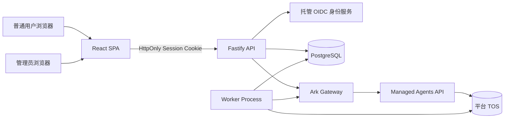
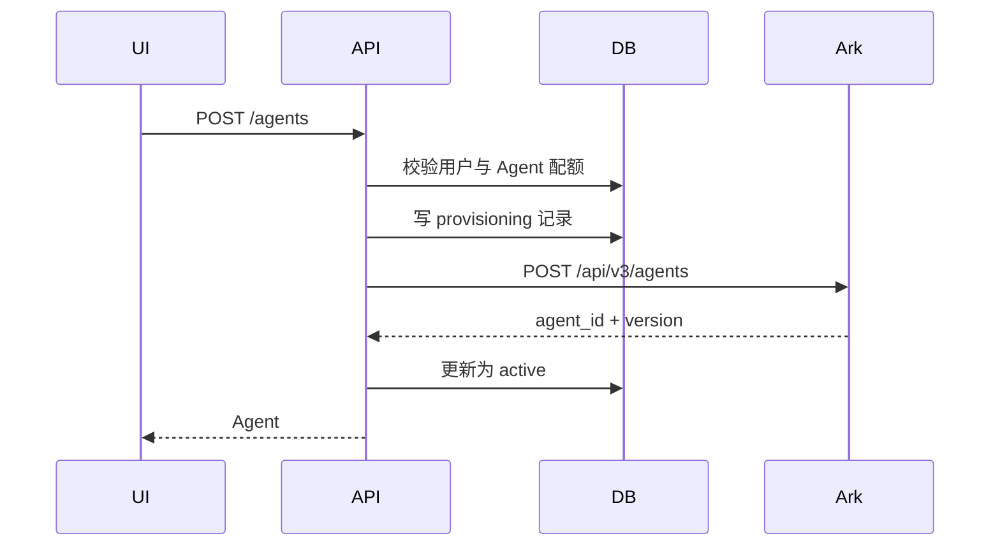

# Personal Work Agent 一期技术设计

## 1. 设计概述

本系统采用 React、Fastify 和 PostgreSQL 构成的 TypeScript 模块化单体，通过服务端 BFF 访问火山引擎方舟 Managed Agents。浏览器不直接接触方舟凭据或方舟资源接口。

系统同时支持两类 Agent：

- 平台 Agent：由管理员创建和维护，可分配给多个普通用户，只允许普通用户引用。
- 个人 Agent：由普通用户创建和维护，只属于创建者。

每个 Session 都属于一个普通用户，并在创建时固定绑定一个 Agent 版本。共享平台 Agent 不构成用户间内容共享：Session、事件、输入附件、产物和用量始终按用户隔离。

## 2. 设计依据与约束

### 2.1 Managed Agents 约束

- Agent 是可版本化配置；更新必须携带当前版本并生成新版本。
- Session 创建时绑定 Agent 和 Environment，运行期间不能修改这些配置。
- Session 通过只增不删的 Events 通信。
- SSE 只推送连接建立后产生的事件，重连必须结合完整事件历史去重。
- 输入文件通过 Files API 上传并作为 Session Resource 挂载。
- Agent 产物写入 `/mnt/session/outputs/`，通过 `scope_id=session_id` 查询。
- Session 删除会清除平台默认存储中的产物，但不会删除自有 TOS Bucket 对象。
- Session 沙箱快照保留 30 天，事件历史在 Session 删除前持续保留。

### 2.2 一期约束

- 单个共享火山工作空间和单个共享 Environment。
- 所有外部访问经过 Fastify API。
- 不实现团队空间、用户间共享、Skills、MCP、Vault 或 Memory Store 管理。
- 内置工具集固定为 `agent_toolset_20260701`，权限为 `always_allow`。
- API 与 worker 可作为独立进程运行，但不引入 Redis 或消息队列。

## 3. 总体架构



### 3.1 运行单元

| 单元 | 职责 | 依赖 |
| --- | --- | --- |
| `web` | 工作台、Agent 管理、Session 时间线、文件列表、管理员页面 | API |
| `api` | 认证、授权、配额、业务编排、SSE 代理、静态资源托管 | PostgreSQL、OIDC、Ark Gateway |
| `worker` | 删除重试、孤立资源清理、状态与用量对账 | PostgreSQL、Ark Gateway、TOS |
| `ark-gateway` | 封装 Agent、Session、Events、Files API 和错误映射 | `ARK_API_KEY` |
| `db` | 身份映射、资源归属、状态投影、配额、作业与审计 | PostgreSQL |

### 3.2 代码组织

```text
apps/
  web/                 React + Vite SPA
  api/                 Fastify HTTP/SSE 服务
  worker/              后台作业入口
packages/
  contracts/           API DTO、事件类型和校验 Schema
  db/                  Drizzle Schema、迁移与 Repository
  ark-client/          Managed Agents API 客户端
  auth/                OIDC 与角色解析
  domain/              Agent、Session、File、Quota 业务规则
  ui/                  共享 UI 组件
```

生产镜像包含 SPA 构建产物、API 和 worker 入口。API 进程提供静态 SPA 与 `/api`；worker 使用同一镜像和不同启动命令。

## 4. 身份、角色与租户边界

### 4.1 身份认证

托管身份服务负责邮箱验证码流程，并通过标准 OIDC 返回身份。Fastify 完成 OIDC 回调后创建应用会话，将随机会话令牌放入 `HttpOnly`、`Secure`、`SameSite=Lax` Cookie；数据库仅保存令牌哈希。

所有业务请求从服务端会话解析：

```text
AuthContext {
  userId
  authSubject
  role: "user" | "admin"
}
```

客户端请求体不得包含可参与授权判断的 `owner_id`、`tenant_id` 或 `role`。

### 4.2 授权规则

- 普通用户资源查询必须同时包含业务主键和 `owner_user_id`。
- 资源不存在与资源不属于当前用户均返回 `404 RESOURCE_NOT_FOUND`。
- 平台 Agent 只有在处于启用状态且已分配给当前用户时才可用于新建 Session。
- 普通用户不能更新或删除平台 Agent。
- 管理员路由只允许管理平台 Agent、用户默认 Agent 分配和配额。
- 管理员路由不提供 Session 正文、输入附件内容或产物下载能力。

授权在 Domain Service 调用 Ark Gateway 之前完成。Ark Gateway 不接受来自 HTTP 请求的任意资源 ID，只接受已由 Repository 解析出的内部资源记录。

## 5. 数据模型

所有主键使用应用生成的 UUID；方舟 ID 单独保存并加唯一约束。时间统一存储为 UTC。

### 5.1 用户与会话认证

#### `users`

| 字段 | 说明 |
| --- | --- |
| `id` | 应用用户 ID |
| `auth_subject` | OIDC `sub`，唯一 |
| `email` | 规范化邮箱 |
| `role` | `user` 或 `admin` |
| `status` | `active` 或 `disabled` |
| `created_at`, `updated_at` | 审计时间 |

#### `auth_sessions`

保存会话令牌哈希、用户 ID、过期时间和撤销时间。原始令牌仅存在于浏览器 Cookie。

### 5.2 Agent

#### `platform_agents`

| 字段 | 说明 |
| --- | --- |
| `id` | 应用平台 Agent ID |
| `ark_agent_id` | 方舟 Agent ID，唯一 |
| `name`, `description` | 展示信息 |
| `model_id`, `system_prompt` | 当前配置投影 |
| `ark_version` | 当前方舟版本 |
| `status` | `provisioning`、`active`、`disabled`、`failed`、`deleting` |
| `created_by`, `updated_by` | 管理员用户 ID |
| `last_error_code` | 最近一次同步错误 |

#### `personal_agents`

结构与平台 Agent 相同，使用 `owner_user_id` 代替管理员归属字段。`owner_user_id + ark_agent_id` 建立唯一约束。

#### `user_default_agents`

| 字段 | 说明 |
| --- | --- |
| `user_id` | 普通用户 ID，主键 |
| `platform_agent_id` | 已启用的平台 Agent |
| `assigned_by` | 管理员用户 ID |
| `assigned_at` | 分配时间 |

每名普通用户最多存在一条当前分配。历史 Session 自身保存 Agent 快照引用，不依赖此表恢复。

### 5.3 Session 与事件投影

#### `sessions`

| 字段 | 说明 |
| --- | --- |
| `id` | 应用 Session ID |
| `owner_user_id` | 唯一租户归属 |
| `ark_session_id` | 方舟 Session ID，唯一 |
| `agent_kind` | `platform` 或 `personal` |
| `platform_agent_id` / `personal_agent_id` | 二选一 |
| `ark_agent_id`, `agent_version` | 创建时固定快照 |
| `environment_id` | 平台 Environment ID |
| `title` | 会话标题 |
| `status` | 方舟状态投影 |
| `archived_at` | 归档时间 |
| `deletion_state` | `none`、`pending`、`deletion_failed`、`deleted` |
| `last_event_at` | 最近事件时间 |
| `created_at`, `updated_at` | 审计时间 |

数据库使用检查约束保证平台 Agent 与个人 Agent 引用恰有一个非空。

#### `session_event_cursors`

仅保存 `session_id`、最后观察时间和最近事件 ID 集合的短期去重信息，不保存完整对话正文。完整事件历史以方舟为权威来源。

### 5.4 文件与产物

#### `session_inputs`

保存用户、临时上传状态、方舟 `file_id`、文件元数据、目标 `mount_path` 和绑定的 Session。未绑定上传通过 `expires_at` 标记，由 worker 清理。

#### `artifacts`

保存用户、Session、方舟文件 ID、TOS 对象键、名称、MIME、大小、生成时间和删除状态。下载 URL 不持久化，每次在授权后获取或签发。

### 5.5 配额、用量与后台作业

#### `quota_policies`

保存系统默认值：个人 Agent 上限 10、并发 Session 上限 2、每日 Session 上限和月度 Token 上限。

#### `user_quota_overrides`

按用户覆盖具体配额；空字段继承系统默认值。

#### `usage_ledger`

按 `user_id + ark_session_id + ark_event_id + metric_type` 唯一记录 Token、运行时长和工具调用增量，避免重放事件导致重复计量。

#### `background_jobs`

保存 `delete_session`、`delete_artifact`、`cleanup_upload`、`reconcile_session` 作业。包含状态、重试次数、下次执行时间和最后错误；worker 使用 `FOR UPDATE SKIP LOCKED` 领取作业。

#### `audit_logs`

记录管理员配置变更及用户资源写操作，只保存标识、动作、结果、关联 ID 和方舟请求 ID，不保存消息正文、文件内容或密钥。

## 6. 后端模块与接口

所有请求与响应由共享 Schema 校验。API 前缀为 `/api/v1`。

### 6.1 Auth

| 方法与路径 | 用途 |
| --- | --- |
| `POST /auth/email-code` | 请求托管身份服务发送验证码 |
| `POST /auth/verify` | 验证回调或验证码并建立应用会话 |
| `POST /auth/logout` | 撤销应用会话 |
| `GET /me` | 返回当前用户、角色、配额摘要和默认 Agent 状态 |

### 6.2 普通用户 Agent

| 方法与路径 | 用途 |
| --- | --- |
| `GET /agents` | 返回已分配平台 Agent 与个人 Agent |
| `POST /agents` | 创建个人 Agent |
| `GET /agents/:id` | 获取可用 Agent |
| `PATCH /agents/:id` | 更新个人 Agent |
| `DELETE /agents/:id` | 删除个人 Agent |

平台 Agent 返回 `kind=platform` 与 `editable=false`。个人 Agent 返回 `kind=personal` 与 `editable=true`。

### 6.3 管理员

| 方法与路径 | 用途 |
| --- | --- |
| `GET /admin/platform-agents` | 列出平台 Agent |
| `POST /admin/platform-agents` | 创建平台 Agent |
| `PATCH /admin/platform-agents/:id` | 更新、启用或停用 |
| `DELETE /admin/platform-agents/:id` | 删除无引用的平台 Agent |
| `GET /admin/users` | 查询用户及默认 Agent 分配状态，不返回用户内容 |
| `PUT /admin/users/:id/default-agent` | 指定默认平台 Agent |
| `PUT /admin/users/:id/quota` | 调整用户配额 |

### 6.4 Session

| 方法与路径 | 用途 |
| --- | --- |
| `POST /sessions` | 校验配额、上传绑定关系并创建空闲 Session |
| `GET /sessions` | 列出当前用户 Session，支持归档筛选 |
| `GET /sessions/:id` | 返回 Session 元数据与 Agent 版本 |
| `POST /sessions/:id/messages` | 提交 `user.message` |
| `POST /sessions/:id/interrupt` | 提交 `user.interrupt` |
| `GET /sessions/:id/events` | 代理并恢复 SSE 事件流 |
| `POST /sessions/:id/archive` | 归档 |
| `DELETE /sessions/:id/archive` | 恢复归档 |
| `DELETE /sessions/:id` | 创建永久删除作业 |

### 6.5 文件

| 方法与路径 | 用途 |
| --- | --- |
| `POST /uploads` | 上传一期 Session 输入文件 |
| `DELETE /uploads/:id` | 删除尚未绑定的输入文件 |
| `GET /artifacts` | 查询当前用户产物 |
| `GET /artifacts/:id/download` | 授权后获取或代理下载 |
| `DELETE /artifacts/:id` | 创建产物删除作业 |

### 6.6 预留模块

`/skills`、`/mcp-servers`、`/vaults` 和 `/memory-stores` 在一期只定义模块边界和导航能力状态，不暴露创建、更新或删除接口。前端通过 `/capabilities` 获取 `available=false`，不渲染伪可用控件。

## 7. 关键流程

### 7.1 创建个人 Agent



若方舟调用结果未知，记录保持 `provisioning` 或进入 `failed`，worker 根据关联 ID 对账。系统不在未确认上游结果时重复创建。

### 7.2 创建并启动 Session

1. 用户可先上传附件，形成有过期时间的私有暂存记录。
2. API 在数据库事务中锁定用户配额记录，校验月度 Token、每日新建数和并发数。
3. API 校验所选 Agent：个人 Agent 必须归属用户；平台 Agent 必须已分配且启用。
4. API 使用固定平台 Environment、Agent 最新版本和附件资源调用方舟创建 Session。
5. API 保存 Session 归属、实际 Agent 版本和附件绑定。
6. 浏览器连接 `GET /sessions/:id/events`。
7. SSE 连接确认后，浏览器调用 `POST /sessions/:id/messages` 提交首条消息。

创建 Session 与发送首条消息保持为两个显式步骤，以满足“先建立流、后产生事件”的约束。UI 将两步呈现为一次连续的新建任务体验。

### 7.3 SSE 初次连接与重连

API 建立上游 SSE 后再返回下游流。重连过程如下：

1. 建立新的方舟 SSE 流并暂存实时事件。
2. 拉取该 Session 的完整事件历史。
3. 向浏览器发送历史事件。
4. 按 `event.id` 丢弃暂存流中已存在于历史的事件。
5. 按到达顺序继续转发实时事件。

浏览器也按 `event.id` 维护去重集合。事件渲染器将方舟事件转换为稳定的 UI 类型，但保留原始 `type` 和 `id` 供诊断。

### 7.4 归档与永久删除

归档只更新 `archived_at`。永久删除采用后台 Saga：

1. API 二次确认后将 `deletion_state` 设为 `pending` 并创建作业。
2. 若 Session 为 `running`，worker 发送 `user.interrupt` 并等待非运行状态。
3. worker 删除方舟 Session。
4. worker 删除该 Session 对应的自有 TOS 对象。
5. worker删除输入映射、产物索引、用量明细和 Session 本地记录。
6. 任一步骤失败时记录 `deletion_failed`，使用指数退避重试。

删除操作按步骤记录完成标记，使重复执行具有幂等效果。

### 7.5 平台 Agent 管理与分配

- 管理员创建平台 Agent 后，普通用户只有在获得分配后才能看到和使用。
- 每个用户只有一条当前默认分配，更新使用数据库事务完成。
- 停用平台 Agent 前，系统列出受影响的当前用户分配；停用后这些用户不能使用该 Agent 创建新 Session。
- 已有 Session 保存 `ark_agent_id + agent_version`，不受分配、停用或更新影响。
- 仍被用户分配或任一 Session 引用的平台 Agent 不允许删除。

## 8. 前端信息架构与交互

### 8.1 普通用户工作台

左侧固定导航包含：

- 新建任务
- Agent
- 我的文件
- 上下文管理（一期未开放）
- 设置
- 未归档任务列表

主区域默认展示紧凑的任务输入区。输入区包含 Agent 选择、附件按钮、文本输入和发送按钮。平台 Agent 使用“平台”标识并隐藏编辑操作，个人 Agent 可进入编辑页。

### 8.2 Session 页面

- 顶部显示标题、状态、Agent 名称和只读版本。
- 主区按事件时间展示用户消息、Agent 回复和折叠式工具活动。
- `thinking` 只显示状态，不展示推理文本。
- `rescheduled` 显示自动恢复提示，不要求用户操作。
- 运行状态提供中断按钮。
- 归档与永久删除位于会话菜单，永久删除使用确认对话框。

### 8.3 Agent 页面

列表分为“平台提供”和“我的 Agent”。个人 Agent 表单只包含名称、描述、模型和 System Prompt。模型使用平台允许列表，内置工具集不提供一期编辑控件。

### 8.4 我的文件

只展示产物，不展示输入附件。支持按 Session 筛选、查看元数据、下载和永久删除。下载操作不暴露长期有效的公共 URL。

### 8.5 管理员页面

管理员页面与普通工作台导航分离，仅包含：

- 平台 Agent 列表与编辑器。
- 用户列表、默认平台 Agent 分配和配额调整。
- 不展示用户消息、附件内容或产物入口。

### 8.6 响应式与可访问性

- 桌面端使用窄侧栏和宽内容区；移动端侧栏变为抽屉。
- 固定格式控件使用稳定尺寸，事件加载不得推动输入区跳动。
- 图标按钮使用 Lucide 图标、可访问名称和 Tooltip。
- 键盘可完成导航、发送、中断、关闭对话框和文件操作。

## 9. 配额与用量

### 9.1 配额判定

有效配额由用户覆盖值与系统默认值合并得到。创建个人 Agent、创建 Session 和发送消息分别在服务端校验对应配额。

并发 Session 数以本地 `running` 状态为快速判定，并在临界操作前查询方舟状态复核。配额预占在数据库事务内执行，创建失败后释放。

### 9.2 用量采集

- `span.model_request_end` 累加 Token。
- 工具调用事件按唯一 `event.id` 计数。
- Session 从 `status_running` 到非运行状态的区间累计运行时长。
- 重连或历史重放通过 `usage_ledger` 唯一约束去重。

达到月度 Token 上限后，API 拒绝新的 Session 启动和消息提交；正在运行的任务在观察到越限后发送中断。历史读取、归档、删除和下载保持可用。

## 10. 错误处理与一致性

### 10.1 标准错误

API 返回稳定错误结构：

```json
{
  "error": {
    "code": "QUOTA_EXCEEDED",
    "message": "本月可用额度已用完",
    "requestId": "req_xxx",
    "retryable": false
  }
}
```

错误类别包括：

- `AUTH_REQUIRED`、`FORBIDDEN`。
- `RESOURCE_NOT_FOUND`。
- `VALIDATION_FAILED`。
- `QUOTA_EXCEEDED`、`CONCURRENCY_LIMITED`。
- `ARK_RATE_LIMITED`、`ARK_UNAVAILABLE`、`ARK_CONFLICT`。
- `SESSION_TERMINATED`、`SESSION_BUSY`。
- `DELETION_PENDING`、`DELETION_FAILED`。

### 10.2 重试

- 只对网络失败、HTTP 429 和可恢复 5xx 使用带抖动的指数退避。
- 用户写操作不在结果未知时盲目重放；先进入待对账状态。
- SSE 断线由客户端自动重连。
- 删除和清理由 worker 重试，达到最大次数后保留失败状态并报警。
- Agent 版本冲突时重新读取当前版本，提示用户刷新后再次保存，不自动覆盖他人修改。

### 10.3 数据权威

- 方舟：Agent 版本、Session 实际状态、完整事件历史和 Files API 元数据。
- PostgreSQL：用户身份、角色、资源归属、平台 Agent 分配、归档、配额、作业和审计。
- TOS：产物二进制对象。

worker 定期对账本地状态与方舟状态，但不自动把无法归属的方舟资源分配给任何用户。

## 11. 安全设计

- `ARK_API_KEY` 只通过服务端 Secret 注入，不进入数据库、前端包或日志。
- OIDC Client Secret、SMTP 或身份服务密钥采用部署平台 Secret 管理。
- 所有输入使用 Schema 白名单校验，禁止透传未声明的方舟字段。
- Session、文件和 Agent 路由使用统一 Tenant Guard。
- 管理员写操作使用 Role Guard 并写审计日志。
- 上传文件名进行规范化，`mount_path` 由服务端生成，拒绝路径穿越。
- 下载采用短期签名 URL 或服务端流式代理，并设置 `Content-Disposition`。
- 日志默认脱敏 Authorization、Cookie、token、System Prompt、消息正文和文件内容。
- 同源部署并启用严格 CORS、内容安全策略、速率限制和安全响应头。

## 12. 测试策略

### 12.1 单元测试

- Agent 所有权与平台 Agent 分配规则。
- 配额合并、预占、释放和月度窗口。
- 事件归一化与 `event.id` 去重。
- Session 状态迁移与删除 Saga。
- Ark 错误到应用错误的映射。

### 12.2 集成测试

- 使用测试 PostgreSQL 验证事务、唯一约束和 `SKIP LOCKED` 作业领取。
- 使用可编程 Ark Stub 验证 Agent 版本冲突、Session 生命周期、429/5xx 和未知结果。
- 验证管理员不能读取用户内容。
- 对 Agent、Session、上传、产物和用量接口逐一执行跨租户 ID 替换测试，越权场景覆盖率必须为 100%。

### 12.3 SSE 契约测试

- 首次连接后发送消息不会漏掉首个事件。
- 重连期间历史事件与实时事件交叉时不重复。
- `running → rescheduled → running → idle` 正确呈现。
- 浏览器取消连接会释放上游连接。
- Session 删除或终止后流正常关闭。

### 12.4 端到端测试

- 邮箱验证码登录到默认平台 Agent 首次任务。
- 创建、编辑和删除个人 Agent。
- 上传附件、运行任务、查看并下载产物。
- 多轮消息、中断、归档、恢复和永久删除。
- 管理员创建平台 Agent、分配用户、更新版本和处理删除冲突。
- 两个用户并行运行时互不可见。

## 13. 部署与运维

- 使用单一 OCI 镜像部署到火山引擎中国区长驻容器或云主机。
- API 与 worker 使用独立进程和独立健康检查。
- PostgreSQL 使用托管实例并启用自动备份。
- TOS Bucket 默认私有，生命周期规则由平台管理。
- `/health/live` 仅检查进程存活；`/health/ready` 检查数据库和必要配置，不在每次探针中调用方舟付费接口。
- 日志使用结构化 JSON，包含 `request_id`、`user_id`、资源类型、资源 ID、结果和 Ark Request ID。
- 告警覆盖登录失败异常、方舟错误率、SSE 异常断开、删除作业积压、配额拒绝率和对账差异。

## 14. 后续扩展边界

二期模块通过既有 Agent 与 Session 聚合扩展：

- Skills：创建或导入 Skill 后，将版本化引用加入 Agent。
- MCP：平台或用户声明 MCP Server，并以最小工具白名单挂载。
- Vault：每个用户独立 Vault，创建 Session 时注入 `vault_ids`。
- Memory Store：作为只读 Session Resource 挂载，由独立管理流程写入。

这些模块不得绕过现有 Tenant Guard、Ark Gateway、配额、审计和 Session 版本快照。

## 15. 需求追踪

| 需求 | 设计落点 | 主要验证 |
| --- | --- | --- |
| 1 | 4.1、6.1 | Auth 集成与 E2E |
| 2 | 4.2、5、11 | 跨租户集成测试 |
| 3 | 5.2、7.2、7.5 | 默认 Agent E2E |
| 4 | 5.2、6.2、7.1 | Agent CRUD 测试 |
| 5 | 5.2、7.1、7.5 | 版本冲突与固定版本测试 |
| 6 | 5.3、6.4、7.2 | Session 生命周期测试 |
| 7 | 5.3、7.3、12.3 | SSE 契约测试 |
| 8 | 5.4、6.5、7.2 | 上传与挂载集成测试 |
| 9 | 5.4、6.5、7.4 | 产物授权与删除测试 |
| 10 | 5.3、7.4、10 | 删除 Saga 测试 |
| 11 | 2.2、7.2、11 | 环境配置与权限测试 |
| 12 | 4、11 | Secret 扫描与安全测试 |
| 13 | 5.5、9 | 配额并发与用量去重测试 |
| 14 | 8 | 响应式与可访问性 E2E |
| 15 | 4.2、5.2、6.3、7.5 | 管理员授权与分配 E2E |
| 16 | 3、10、12、13 | 构建、健康检查和故障注入 |
